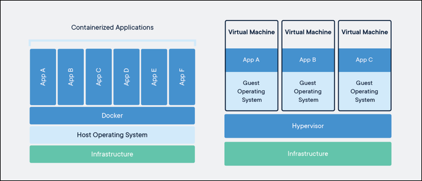

# آشنایی با داکر
داکر یکی از تکنولوژی های بسیار کاربردی می باشد که کمک زیادی را به توسعه دهندگان نرم افزاری می کند. داکر نوعی تکنولوژی مجازی سازی هست، مانند ماشین های مجازی، که محیط اجرای برنامه را مستقل از محیط نرم افزاری ماشین اصلی می کند. فرض کنید یک برنامه ای توسعه دادید که به نسخه های خاصی از پکیج های نرم افزاری وابسته است، مثلا نسخه ی سیستم عامل یا کامپایلر و ... . در روش سنتی، شما یک سیستم عامل با محیط نرم افزاری مخصوص این برنامه آماده میکنید، هر کسی هم که مایل به استفاده از برنامه ی شما باشد، باید دستور العمل ها و محدودیت های شما را آماده سازی نماید تا این برنامه ی شما قابل اجرا شود. انجام این اقدامات می تواند دشوار باشد یا با سایر نرم افزارها در تداخل باشد. حال فرض کنید برنامه های مختلفی توسعه داده شده که هر کدام محدودیت های نرم افزاری خودشان را دارند! پس باید برای هر کدام، یک ماشین مجزا تهیه شود. خب این روش هزینه بر میباشد و نگهداری آن را دشوار می 
کند. 

داکر مشکلاتی که ذکر شد را برطرف می نماید. در واقع برای اجرای برنامه ها، دیگر نیازی به ساخت ماشین مجازی مجزا نیست، هر کدام از برنامه ها در محیط هایی بنام کانیتنر Container خودشان اجرا می شوند و تداخلی در محیط یکدیگر یا سیستم عامل ندارند. در ادامه بیشتر با داکر آشنا می شویم.

## نصب داکر
با توجه به سیستم عاملت، برای نصب داکر، از این صفحه استفاده کن:   
[آموزش نصب داکر](https://docs.docker.com/engine/install/)

## مقدمات داکر
بعد از نصب، از طریق لینک زیر با دستورات ابتدایی داکر برای کار با کانتینرها استفاده کن:

[آموزش مقدمات و دستورات داکر](https://docker-curriculum.com)

این صفحه رو تا قسمت Terminology بخونی و انجام بدی کافیه.

## ساخت کانتینر
حالا که با کلیات و دستورات مهم داکر آشنا شدی، از طریق لینک زیر با ساخت کانتینر برای برنامه های پایتونی آشنا شو:    

[آموزش ساخت کانتینر](https://www.youtube.com/watch?v=bi0cKgmRuiA)

* خب حالا به دلخواه، یکی از پروژه هایی که در قسمت های قبلی انجام دادی رو داکرایز کن.