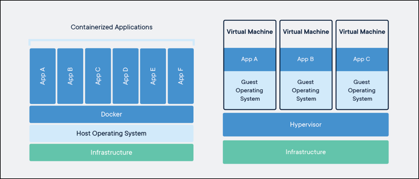

# آشنایی با داکر
داکر یکی از تکنولوژی های بسیار کاربردیه که کمک زیادی رو به توسعه دهندگان نرم افزاری می کنه. داکر نوعی تکنولوژی مجازی سازیه، مانند ماشین های مجازی، که محیط اجرای برنامه را مستقل از محیط نرم افزاری ماشین اصلی می کنه. فرض کن یک برنامه ای توسعه دادی که به نسخه های خاصی از پکیج های نرم افزاری وابسته ست، مثلا نسخه ی سیستم عامل یا کامپایلر و ... . در روش سنتی، یک سیستم عامل با محیط نرم افزاری مخصوص این برنامه آماده میکنی، هر کسی هم که مایل به استفاده از برنامه ی شما باشد، باید دستور العمل ها و محدودیت های شما را آماده سازی کنه تا این برنامه ی شما قابل اجرا بشه. انجام این اقدامات می تونه دشوار باشه یا با سایر نرم افزارها در تداخل باشه. حال فرض کن برنامه های مختلفی توسعه داده شده که هر کدوم محدودیت های نرم افزاری خودشون رو دارند! پس باید برای هر کدام، یک ماشین مجزا تهیه بشه. خب این روش هزینه بر هست و نگهداری آن رو دشوار می 
کنه. 

داکر مشکلاتی که ذکر شد رو برطرف می میکنه. در واقع برای اجرای برنامه ها، دیگه نیازی به ساخت ماشین مجازی مجزا نیست، هر کدام از برنامه ها در محیط هایی بنام کانیتنر Container خودشون اجرا می شن و تداخلی در محیط یکدیگر یا سیستم عامل ندارند. در ادامه بیشتر با داکر آشنا می شیم.

## نصب داکر
با توجه به سیستم عاملت، برای نصب داکر، از این صفحه استفاده کن:   
[آموزش نصب داکر](https://docs.docker.com/engine/install/)

## مقدمات داکر
بعد از نصب، از طریق لینک زیر با دستورات ابتدایی داکر برای کار با کانتینرها استفاده کن:

[آموزش مقدمات و دستورات داکر](https://docker-curriculum.com)

این صفحه رو تا قسمت Terminology بخونی و انجام بدی کافیه.

## ساخت کانتینر
حالا که با کلیات و دستورات مهم داکر آشنا شدی، از طریق لینک زیر با ساخت کانتینر برای برنامه های پایتونی آشنا شو:    

[آموزش ساخت کانتینر](https://www.youtube.com/watch?v=bi0cKgmRuiA)

* خب حالا به دلخواه، یکی از پروژه هایی که در قسمت های قبلی انجام دادی رو داکرایز کن.
